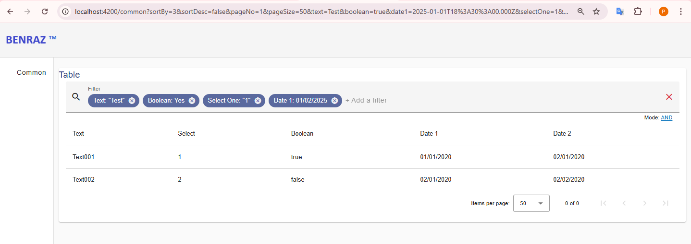
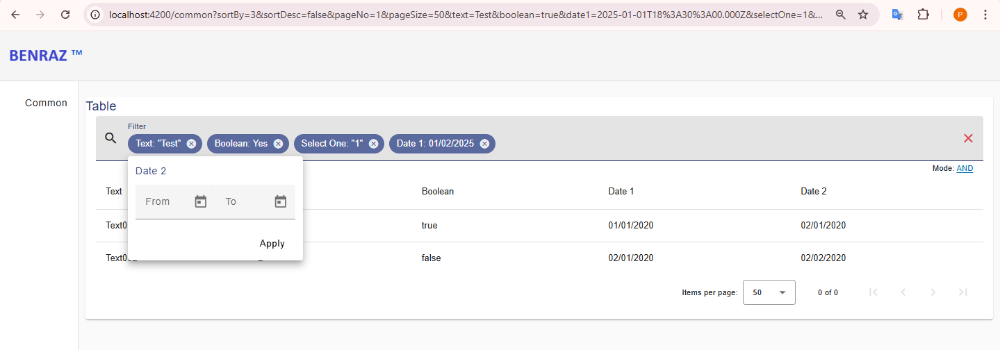

# benraz-npm-common-
Common frontend package

# build instruction
1. npm cache clean --force
2. npm install --legacy-peer-deps
3. npm run build
4. npm run start

# Smart Filter

The **Smart Filter** is a flexible and powerful filtering solution that allows users to dynamically apply filters on data. It supports multiple types of filters, including text, boolean, date, select, multi-select, and date range filters, to help create a refined data search experience. The filter generates a query string in the URL that can be passed to an API endpoint to fetch filtered data, with the results displayed in a grid.

## Features

### 1. Dynamic Parameter Selection
- **Add Multiple Filter Parameters:** Users can easily add multiple filters to refine the displayed data.
- **Autocomplete Suggestions:** As users type, autocomplete suggestions for filter parameters will appear, making filter selection easy.
- **Parameter Chips:** Active filters are displayed as chips, providing a quick visual summary of applied filters.
- **Easy Removal of Filters:** Users can remove individual filter parameters with a simple click, allowing for quick adjustments to the query.

### 2. Filter Types Support
The Smart Filter supports a variety of filter types, including:

- **Text Filters:** Filter results based on exact or partial matches of text.
- **Boolean Filters:** Apply filters based on boolean values.
- **Date Filters:** Filter data by specific dates or date ranges.
- **Select Filters:** Choose one value in a dropdown list.
- **Multi-select Filters:** Select multiple values to refine the dataset.
- **Date range Filters:** Define from and to values for filtering.

## Functionality

- **Query String Preparation:** The Smart Filter prepares the query string based on the selected filter parameters. The filter parameters are incorporated into the URL for easy sharing and bookmarking.
  
- **API Integration:** The query string is passed as part of the URL to the configured API endpoint. The results from the endpoint are fetched and displayed in a grid.

- **Grid Sorting:** The columns of the displayed grid can be sorted, and sorting information is also included in the query string to preserve the user's sort preference across requests.

- **Filter Mode:**
  - **OR Mode:** Filters are applied using the logical OR operator (i.e., any matching filter condition will be considered).
  - **AND Mode:** Filters are applied using the logical AND operator (i.e., only records that meet all filter conditions will be considered).

## Usage

1. **Add Filters:** Select and apply filter parameters to narrow down the data you wish to display.
2. **View Results:** The data is displayed in a grid, with each row matching the applied filter conditions.
3. **Sort Grid:** Use the column headers in the grid to sort data, which is reflected in the query string.
4. **Share URL:** The query string is updated in the URL so that the selected filters and sorting preferences can be shared easily.
5. **Change Mode:** Toggle between **OR** and **AND** mode to adjust how filter conditions are applied.

## UI

